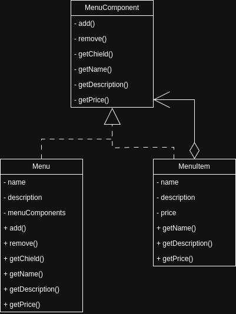
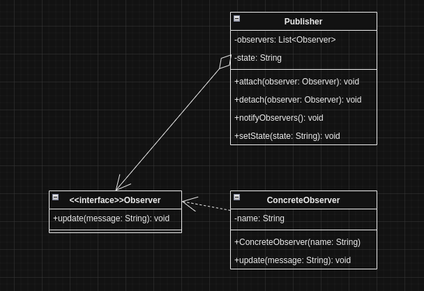
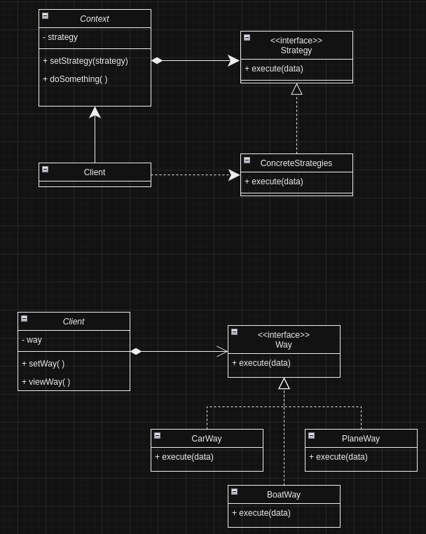

## Padrões de Design

### Composite Pattern
O padrão Composite é usado para tratar objetos individuais e composições de objetos de maneira uniforme.

### Observer Pattern
O padrão Observer define uma dependência um-para-muitos entre objetos, de modo que quando um objeto muda de estado, todos os seus dependentes são notificados e atualizados automaticamente.

### Singleton Pattern
O padrão Singleton garante que uma classe tenha apenas uma instância e fornece um ponto global de acesso a ela.

### Strategy Pattern
O padrão Strategy define uma família de algoritmos, encapsula cada um deles e os torna intercambiáveis. O Strategy permite que o algoritmo varie independentemente dos clientes que o utilizam.

