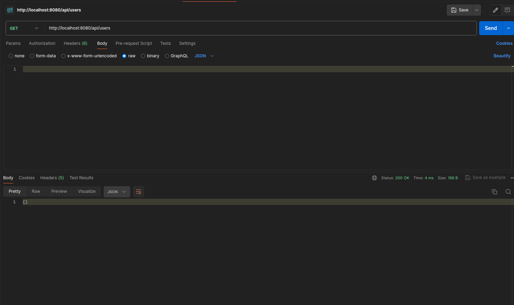
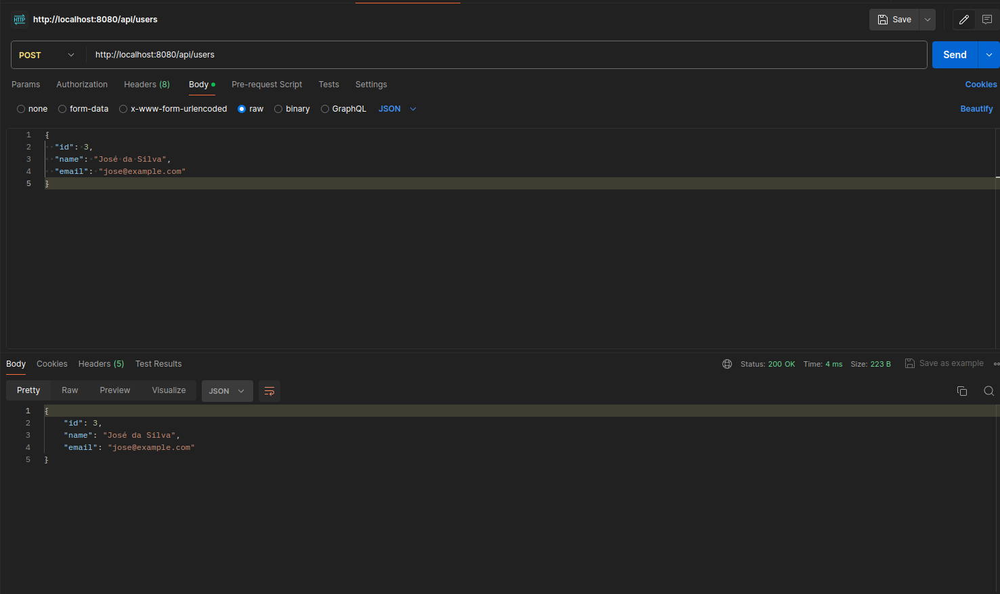
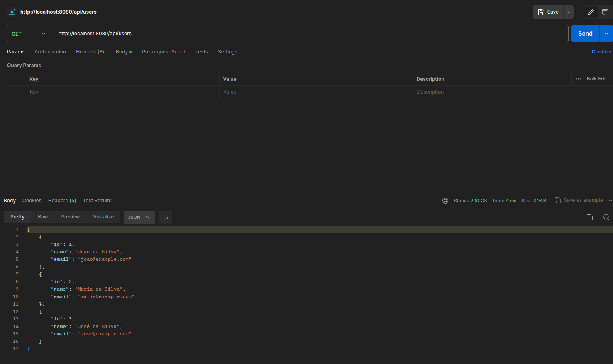
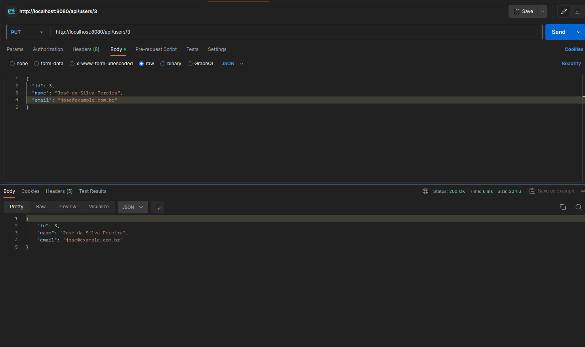
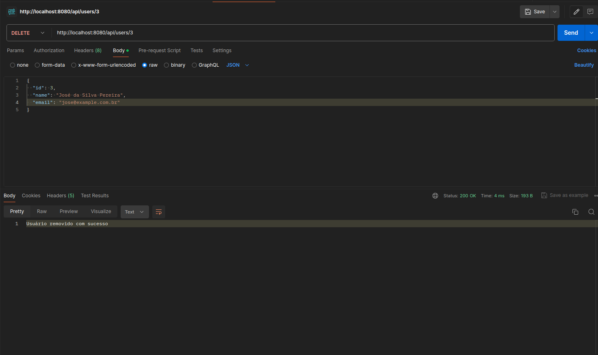

## API REST de Gerenciamento de Usuários 🚀

Bem-vindo à nossa API REST de Gerenciamento de Usuários! Esta API permite criar, atualizar, buscar e excluir informações de usuários.

### Configuração do Projeto

1. Clone ou faça o download deste repositório em sua máquina local.
2. Certifique-se de ter o JDK (Java Development Kit) instalado em sua máquina. Você pode baixá-lo em [Oracle JDK](https://www.oracle.com/java/technologies/javase-jdk11-downloads.html) ou [OpenJDK](https://adoptopenjdk.net/).
3. Certifique-se de ter o Apache Maven instalado. Você pode baixá-lo em [Maven](https://maven.apache.org/download.cgi).
4. Abra o projeto em sua IDE Java de preferência (por exemplo, IntelliJ IDEA, Eclipse).
5. Certifique-se de ter todas as dependências do Maven baixadas.

### Executando a Aplicação

1. Dentro da sua IDE, localize o arquivo `Application.java` no pacote principal.
2. Execute o arquivo `Application.java` como uma aplicação Spring Boot.
3. A aplicação será iniciada e estará pronta para receber solicitações.

### Uso da API

A API oferece os seguintes endpoints:

- `GET /api/users`: Retorna todos os usuários cadastrados.
- `POST /api/users`: Cria um novo usuário com base nos dados fornecidos.
- `PUT /api/users/{id}`: Atualiza as informações de um usuário existente com base no ID fornecido.
- `DELETE /api/users/{id}`: Remove um usuário existente com base no ID fornecido.

Para interagir com a API, você pode usar ferramentas como o [Postman](https://www.postman.com/downloads/) ou fazer solicitações HTTP diretamente.
