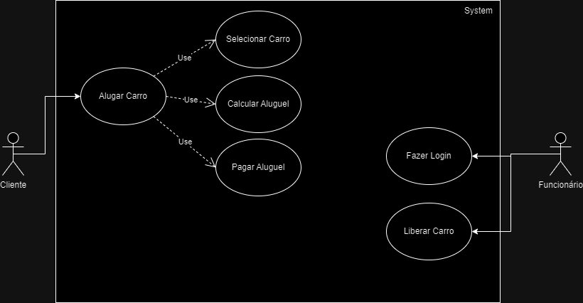
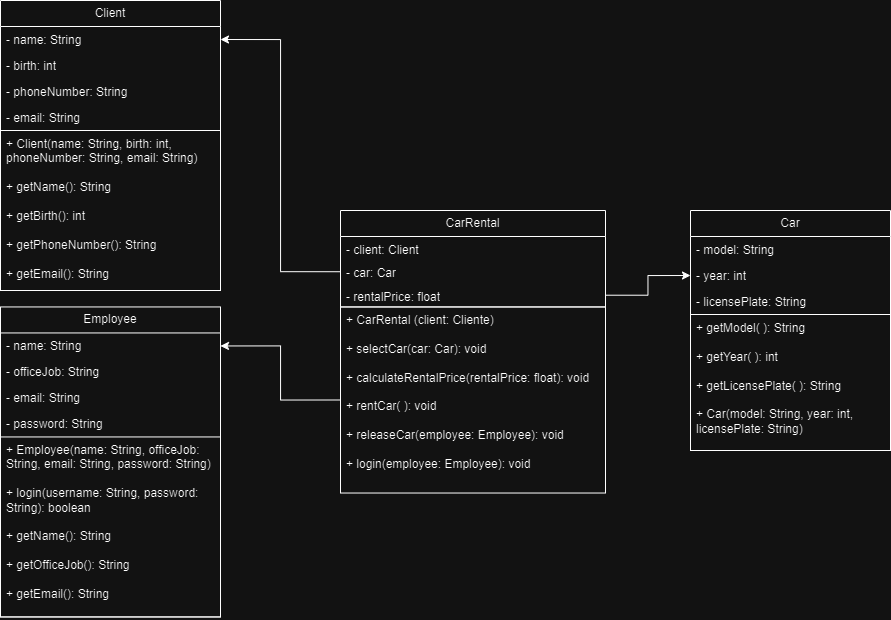

## Programação vs. Engenharia de Software - Atividade 1

We see three critical differences between programming and software engineering: time, scale, and the trade-offs at play. On a software engineering project, engineers need to be more concerned with the passage of time and the eventual need for change. In a software engineering organization, we need to be more concerned about scale and efficiency, both for the software we produce as well as for the organization that is producing it. Finally, as software engineers, we are asked to make more complex decisions with higher-stakes outcomes, often based on imprecise estimates of time and growth.

**Pontos-Chave:**
- **Programação vs. Engenharia:** Programadores criam código, enquanto engenheiros de software projetam para longevidade e adaptabilidade.
- **Tempo e Mudança:** Engenheiros antecipam mudanças, considerando a passagem do tempo e requisitos em evolução.
- **Escala e Eficiência:** Engenharia de software enfatiza eficiência e escala, atendendo tanto aos produtos de software quanto à organização produtora.
- **Decisões Complexas:** Engenheiros de software tomam decisões críticas baseadas em previsões imprecisas, devido à natureza única de cada projeto.

## Perspectiva da Google

Dentro da Google, frequentemente vemos a engenharia de software como programação integrada ao longo do tempo. A programação é um aspecto fundamental, gerando novo software. Distinguir tarefas de programação de tarefas mais amplas de engenharia de software, que abrangem desenvolvimento, modificação e manutenção, torna-se crucial. A dimensão do tempo introduz complexidade, de forma análoga a como cubos diferem de quadrados e distância de velocidade.

**Principais Observações:**
- **Integração do Tempo:** Engenharia de software vai além da programação, considerando o aspecto temporal do desenvolvimento.
- **Delimitação de Tarefas:** Diferenciar entre programação e tarefas mais abrangentes de engenharia de software.
- **Tempo como Dimensão:** O tempo adiciona profundidade e complexidade à engenharia de software além da mera codificação.

## Exemplos de Compensações - Atividade 2

O desenvolvimento de software envolve fazer compensações para encontrar equilíbrio. Considere três exemplos:

- **Complexidade vs. Simplicidade:** A decisão entre soluções intrincadas e simplicidade direta impacta a usabilidade e a velocidade de desenvolvimento.
- **Custo vs. Tempo:** Equilibrar restrições orçamentárias com prazos do projeto requer priorização de recursos.
- **Recursos vs. Baixa Velocidade:** Alocar muitos recursos pode resultar em execução lenta, enquanto recursos limitados podem melhorar a velocidade.

## Heurísticas - Atividade 3

- https://www.nngroup.com/articles/ten-usability-heuristics/

**Qual requisito não é funcional?** Usabilidade.

**Qual a importância?** Experiência do Usuário (UX).

**Como obter este requisito não funcional no meu software?** Aplicando estas 10 heurísticas. 

**Encontre 1 erro e 1 acerto de cada heurística.**

**Visibilidade do status do sistema** 
- **Acerto:** Barra de carregamento de vídeo do Youtube. / **Erro:** Falta de indicador de progresso durante o carregamento de uma página.

**Correspondência entre o sistema e o mundo real** 
- **Acerto:** Sistema de localização (GPS) / **Erro:** Uso de linguagem técnica ao invés de uma linguagem simples e compreensível.

**Controle e liberdade do usuário** 
- **Acerto:** Botão para desfazer alguma ação. / **Erro:** Não haver um botão para cancelar processo longo ou para salvar esse processo no meio do caminho.

**Consistência e padrões** 
- **Acerto:** Icones padrões, como uma lupa para pesquisar, carrinho para comprar. / **Erro:** Mudar a ordem, localidade e icones dos botões em diferentes telas.

**Prevenção de erros** 
- **Acerto:** Impedir que o usuário delete o arquivo em uso. / **Erro:** Fazer alterações em pastas essênciais sem aviso prévio. 

**Reconhecimento em vez de lembrança** 
- **Acerto:** Usar icones padrão, como a lixeira para simbolizar exclusão. / **Erro:** Utilizar icones fora de contexto.

**Flexibilidade e eficiência de uso** 
- **Acerto:** Atalhos para realizar funções. / **Erro:** Não personalização dos próprios atalhos.

**Design estético e minimalista** 
- **Acerto:** Fácil e intuítivo para navegar. / **Erro:** Falta de personalização e funções.

**Ajude os usuários a reconhecer, diagnosticar e recuperar-se de erros** 
- **Acerto:** Mensagem de erro com uma linguagem simples para o usuário. /  **Erro:** Mensagem de erro genérica e com linguagem técnica.

**Ajuda e documentação** 
- **Acerto:** Ajuda para reconhecer o erro para melhor saná-lo / **Erro:** Não disponibilizar nenhuma forma de consulta.

## Construir Diagrama de Caso de Uso - Atividade 4

## Construir Diagrama UML - Atividade 5

## Código Java (Espelhando classe UML) - Atividade 6

`bertoti/engenharia_sw/CarRentals`

## Código JUnit (Testes Automatizados) - Atividade 7

`bertoti/engenharia_sw/junit`
